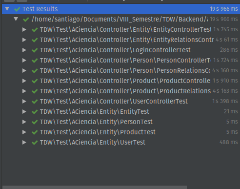

#  Memoria Práctica PHP
*Por: Santiago Caro Duque* ***(BQ0550)***

## Que se hizo
Lo primero que se realizo para poder desarrollar esta practica fue entender a fondo y comprender como funcionaba el codigo entregado por parte de los profesores. Para esto primero se uso la clase realizada por Teams en donde se explicó el funcionamiento básico de la aplicacion y se explicó ademas todo lo que ya estaba implementado y los pasos necesarios para poder desplegarlo. 

Una vez desplegado el servicio básico, se procedió a revisar el código que ya estaba hecho hasta lograr entender cual era su funcionamiento y por que era necesario y en algunos casos cambiarlo para entender que consecuencias tendria al momento de ejecutar la aplicación.

Además, también se corrieron las pruebas que ya estaban definidas en el archivo de pruebas y se verifico cuales eran las que fallaban, en este momento se fijo cual era el objetivo con respecto a la práctica, realizar la implementación del Backend con PHP y su framework slim de la parte de Personas y Entidades.

El trabajo realizado para completar esta practica se dividio en dos tareas principales las cuales cada una tambien se dividieron en dos sub tareas creando asi entonces un esquema de la siguiente manera:

1. Terminar la especificación de la API que ya venia implementada
    * Terminar la API para las personas (persons)
    * Terminar la API para las entidades (entities)
1. Agregar el comportamiento dentro de los controladores para que realicen el comportamiento debido
    * Agregar el comportamiento para el control de las personas (persons)
    * Agregar el comportamiento para el control de las entidades (entities)

La tarea numero 1 se realizó para poder verificar que el trabajo realizado para la tarea numero 2 sea correcta. Asi se tiene un segundo marco de pruebas además del muy completo marco de pruebas ya entregado de manera previa. 

Asi entonces se empezó el desarrollo de la practica intentando realizar la mayor cantidad de verificaciones posibles y pruebas a los componentes que se estaban implementando. 

El resultado fue muy satisfactorio y por lo tanto se termino con todo el set de pruebas completamente aprobado como se puede verificar en la siguiente imagen.



## Despliegue

Para el despliegue de la aplicacion se tendrán que seguir los siguientes pasos: 

(Se asume que ya está descomprimido)


1. Desde donde lo considere mas fácil (se Recomienda phpmyadmin) crear una nueva base de datos vacia con el nombre que prefiera (para usar los datos proporcionados tiene que ser ``` tdw ```)
1. Realizar una copia del archivo ``` .env ``` y se crea un nuevo archivo llamado ``` .env.local ``` y reemplazar las variables
    * **```DATABASE_NAME ```** Con el nombre de la base de datos creada anteriormente
    * **```DATABASE_USER```** Con el un usuario de la base de datos que tenga permisos sobre esta base de datos.
    * **```DATABASE_PASSWD```** y su respectiva contraseña
1. Instalar todo los componentes necesarios mediante el comando
    * ```
        $ composer install 
         ```

1. Actualizar el esquema de la base de datos mediante el comando: 
    * ```
       $ bin/doctrine orm:schema:update --dump-sql --force
        ```
1. Para validar que la base de datos cumpla con los esquemas que están en el proyecto
    * ```
        $ bin/doctrine orm:validate
        ```
1. Por ultimo para ejecutar el servidor con la interfaz de *swagger ui* ejecutar el siguiente comando:
    * ```
        $ php -S 127.0.0.1:8000 -d display_errors=1 -t public 
        ```
    * Y conectarse por medio desde su navegador preferido a: http://127.0.0.1:8000
    * Iniciar sesión con las credenciales por defecto.

## Para ejecutar las pruebas:

1.  Desde donde lo considere mas fácil (se Recomienda phpmyadmin) crear una nueva base de datos vacia con el nombre que prefiera (Pero tiene que ser diferente a la creada anteriormente)
1. Crear una copia del archivo ``` phpunit.xml.dist ``` y reenombrarla a ``` phpunit.xml ``` y cambiar las variables
    * **```DATABASE_NAME ```** Con el nombre de la base de datos creada anteriormente
    * **```DATABASE_USER```** Con el un usuario de la base de datos que tenga permisos sobre esta base de datos.
    * **```DATABASE_PASSWD```** y su respectiva contraseña
1. Ejecutar el siguiente comando desde una terminal:
    * ```
        $ bin/phpunit -c phpunit.xml [--testdox] [--coverage-text]
        ```
## Base de Datos

En el archivo [sqldump.sql](sqldump.sql) esta todo el volcado de la base de datos. Pero las inserciones básicas son las siguientes:

#### Para Entidades
```
INSERT INTO `entity` (`id`, `name`, `birthdate`, `deathdate`, `image_url`, `wiki_url`) VALUES
(1, 'World Wide Web Consortium', '1994-10-01 00:00:00', NULL, 'https://d2908q01vomqb2.cloudfront.net/ca3512f4dfa95a03169c5a670a4c91a19b3077b4/2018/10/18/w3c_logo-800x400.jpg', 'https://en.wikipedia.org/wiki/World_Wide_Web_Consortium'),
(2, 'Organización Europea para la investigación Nuclear', '1954-01-01 00:00:00', NULL, 'https://www.eso.org/public/archives/logos/screen/cern.jpg', 'https://en.wikipedia.org/wiki/CERN'),
(3, 'Free Software Fundation', '1985-10-04 00:00:00', NULL, 'https://pbs.twimg.com/profile_images/471735621946314752/imENUbEK_400x400.png', 'https://en.wikipedia.org/wiki/Free_Software_Foundation'),
(4, 'Netscape', '1994-04-04 00:00:00', NULL, 'https://findicons.com/files/icons/1765/windows_icons_v2/256/netscape.png', 'https://en.wikipedia.org/wiki/Netscape'),
(5, 'Unicode Consortium', '1991-01-03 00:00:00', NULL, 'https://home.unicode.org/wp-content/uploads/2019/12/Unicode-Logo-Final-Blue-95x112.jpg', 'https://en.wikipedia.org/wiki/Unicode_Consortium');


```
#### Para personas
```
INSERT INTO `person` (`id`, `name`, `birthdate`, `deathdate`, `image_url`, `wiki_url`) VALUES
(1, 'Brendan Eich', '1961-06-04 00:00:00', NULL, 'https://unchainedpodcast.com/wp-content/uploads/2020/01/Brendan-Eich.jpg', 'https://en.wikipedia.org/wiki/Brendan_Eich'),
(2, 'Linus Torvalds', '1969-12-28 00:00:00', NULL, 'https://www.channelfutures.com/files/2015/11/linus-torvalds-400x298_0-595x432.jpg', 'https://en.wikipedia.org/wiki/Linus_Torvalds'),
(3, 'Mark Davis', '1952-09-13 00:00:00', NULL, 'https://api.time.com/wp-content/uploads/2016/03/mark-davis-unicode-img_27061-page-001.jpg', 'https://en.wikipedia.org/wiki/Mark_Davis_(Unicode)'),
(4, 'Tim Berners-Lee', '1955-06-08 00:00:00', NULL, 'https://s2.latercera.com/wp-content/uploads/2018/12/Tim.jpg', 'https://en.wikipedia.org/wiki/Tim_Berners-Lee'),
(5, 'Richard Stallman', '1953-03-16 00:00:00', NULL, 'https://encrypted-tbn0.gstatic.com/images?q=tbn%3AANd9GcS7x0V2_5oVEfi3gW6P8PhAxkdXZMJKK-Qo-xRoKuB6Xb_K5fuE', 'https://en.wikipedia.org/wiki/Richard_Stallman');

```
#### Para Productos
```

INSERT INTO `product` (`id`, `name`, `birthdate`, `deathdate`, `image_url`, `wiki_url`) VALUES
(1, 'GNU / Linux', '1991-09-17 00:00:00', NULL, 'https://www.wallpaperflare.com/static/893/596/940/tux-linux-foxyriot-logo-wallpaper.jpg', 'https://en.wikipedia.org/wiki/Linux'),
(2, 'DOM', '1998-10-01 00:00:00', NULL, 'https://www-archive.mozilla.org/docs/dom/technote/whitespace/whitespace_tree.png', 'https://en.wikipedia.org/wiki/Document_Object_Model'),
(3, 'HTML', '1993-01-01 00:00:00', NULL, 'https://cdn.pixabay.com/photo/2017/08/05/11/16/logo-2582748_960_720.png', 'https://en.wikipedia.org/wiki/HTML'),
(4, 'JavaScript', '1995-12-04 00:00:00', NULL, 'https://logodix.com/logo/374740.png', 'https://en.wikipedia.org/wiki/Javascript'),
(5, 'Extensible Markup Language', '1998-01-01 00:00:00', NULL, 'https://png.pngtree.com/png-vector/20190302/ourlarge/pngtree-vector-xml-icon-png-image_719914.jpg', 'https://en.wikipedia.org/wiki/XML');
```

#### Para Entidad que contribuye a un Producto
```
INSERT INTO `entity_contributes_product` (`product_id`, `entity_id`) VALUES
(1, 3),
(2, 1),
(2, 5),
(3, 1),
(3, 2),
(4, 4),
(5, 5);
```

#### Para Persona que contribuye a un Producto
```
INSERT INTO `person_contributes_product` (`product_id`, `person_id`) VALUES
(1, 2),
(1, 5),
(2, 4),
(3, 4),
(4, 3),
(5, 3);
```
#### Para Persona que participa en Entidad
```
INSERT INTO `person_participates_entity` (`entity_id`, `person_id`) VALUES
(1, 4),
(2, 4),
(3, 2),
(3, 5),
(4, 3),
(5, 3);
```